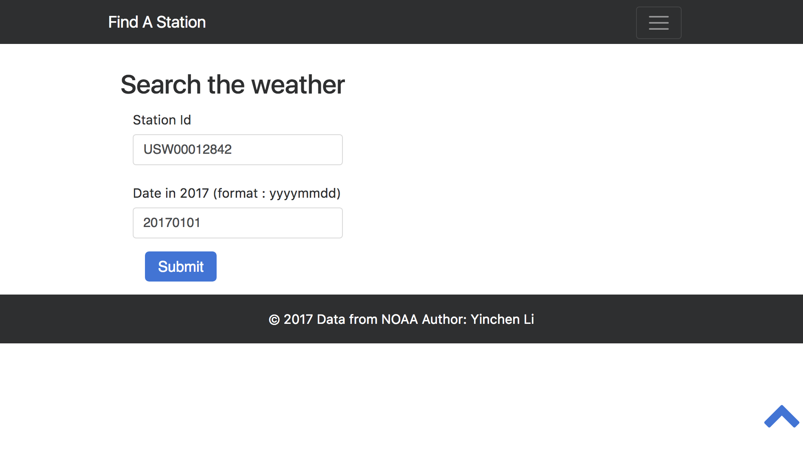
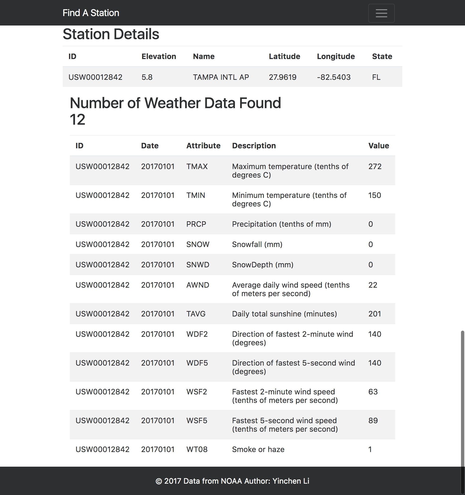
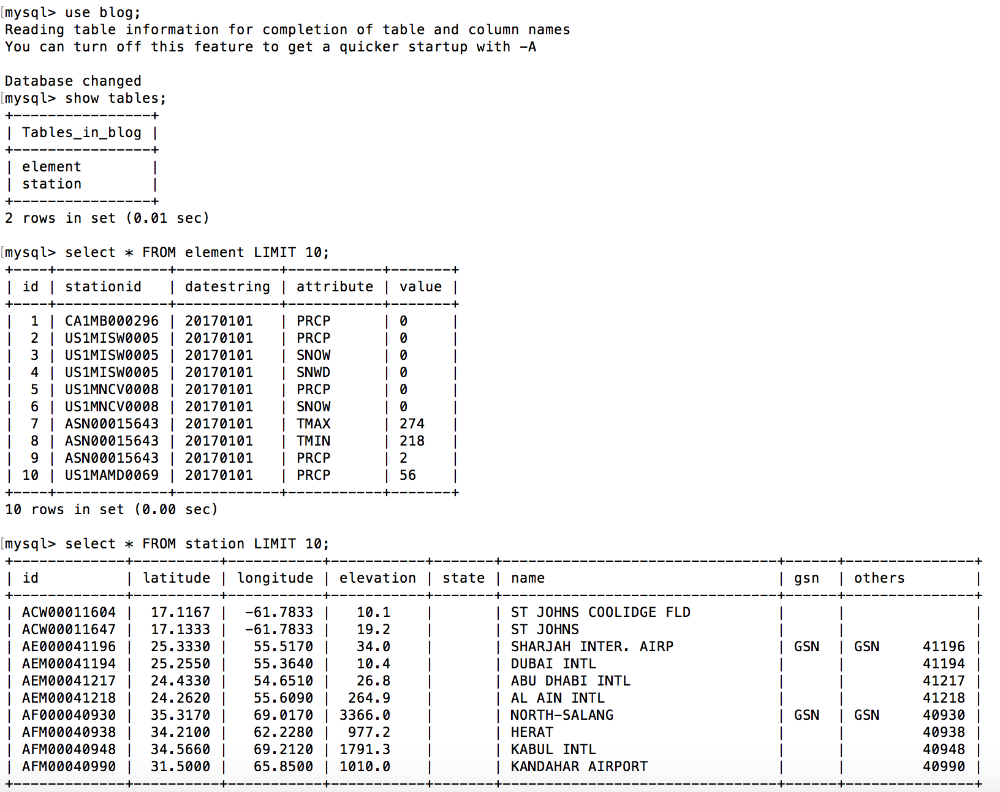
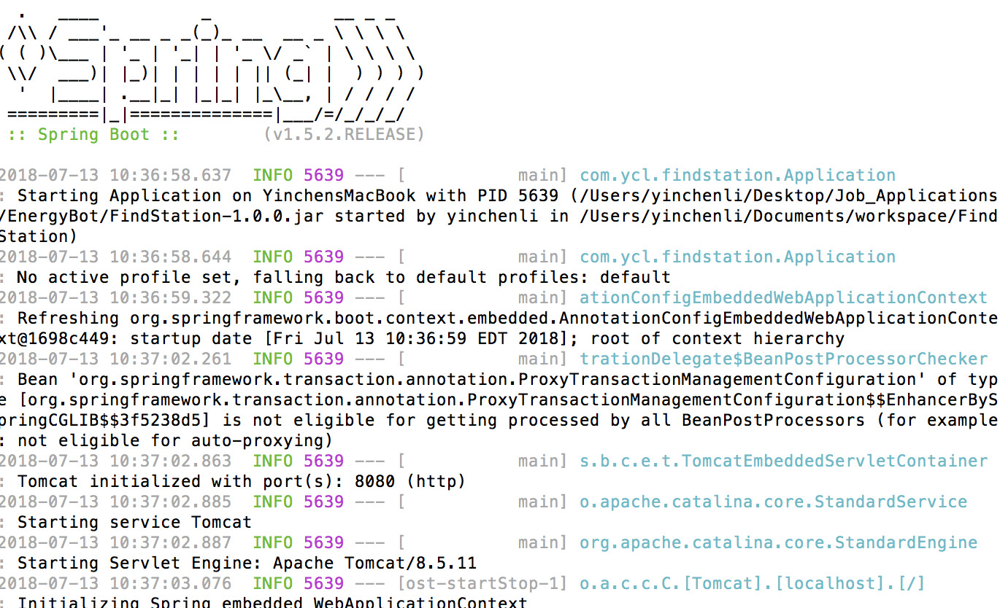
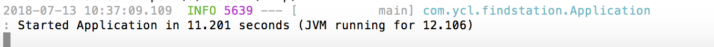
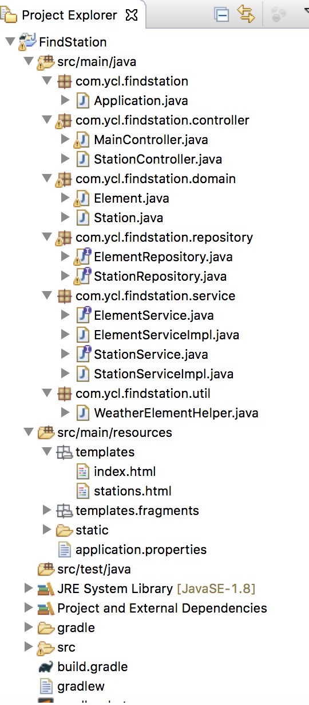

# Find a Station Web Project

This Spring Boot Application will allow you to find a station's weather information on a day in 2017 or all days in 2017. It reads two files

```ghcnd-stations.txt```

and 
```
2017.csv
```

and stores two tables ```station``` and ```element``` in MySQL database 'blog'. Once it is deployed on a machine, it will run on ```localhost:8080```
If you access it through the web browser, you shall see interface like this:



- After you type in a valid station id such as:
```USW00012842```
and a date like [date is not required]
```20170101 ```

You will wait for a few seconds and it will be able to give you the station details, as well as weather information on that day like this:



## Getting Started

These instructions will get you a copy of the project up and running on your local machine for development and testing purposes. 

### Prerequisites

1. **MySQL database** - If you are using local machine, download the MySQL Community Server: <https://dev.mysql.com/downloads/mysql/> 
2. If you are using ubuntu, try 


```
sudo apt-get install mysql-server
```


1. **JAVA 8 SDK**
If you are using local machine, download Java SE Runtime Environment 8 Downloads: <http://www.oracle.com/technetwork/java/javase/downloads/jre8-downloads-2133155.html> 
2. If you are using ubuntu, try 

```
sudo apt-get install default-jre
```

### MySQL Configuration

After you installed mysql, connect to the server, as root, using the command line client:

```
mysql -u root -p
```
You will be prompted for the root password.

Create the anonymous account:

```
create user ''@'localhost' identified by password '';
```

Grant access to the anonymous account:

```
grant all privileges on *.* to ''@'localhost';
```

Exit from the MySQL client: 

```
exit
```

Go to the directory that stores the mysql.sql file, and in run the SQL script I built:

```
mysql < mysql.sql
```
If you go to mysql client again, you will find a database called blog is created, and both the txt file and the weather csv file are loaded into this databse. 

**Output Example**




## Running the application

Now you've set up the database for this web application. You can simply run:

```
java -jar FindStation-1.0.0.jar
```
The Spring Boot application shall start to run.

**Example Output in terminal**


.....

**A successful run will have the last line like this:**



Now you can access the web application through browser:
type ```localhost:8080``` and you will see the interface indicated at the top of this readme.


## Built With

* [Spring Boot Framework](https://spring.io/projects/spring-boot) - The web framework used
* [Gradle](https://gradle.org/) - Dependency Management, the build tool
* [Thymeleaf](https://www.thymeleaf.org/) - frontend tool

## REST Structure of the code

[Eclipse]



## Author
Feel free to contact me if any feedback or question!
Thank you!
Yinchen Li

- CMU Graduate student
- Date Created: 2018.07.13
- Email: careeryinchenli@gmail.com